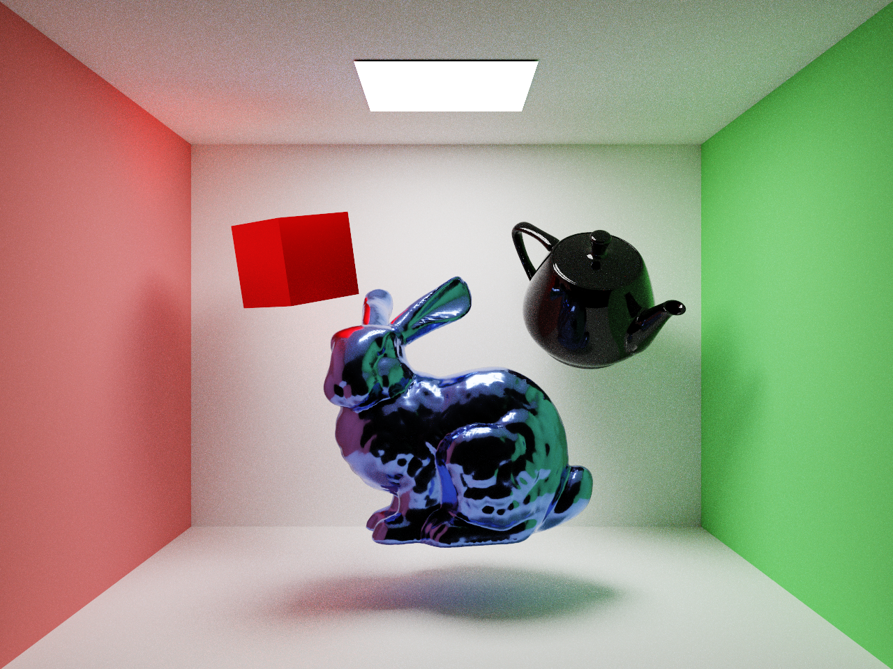
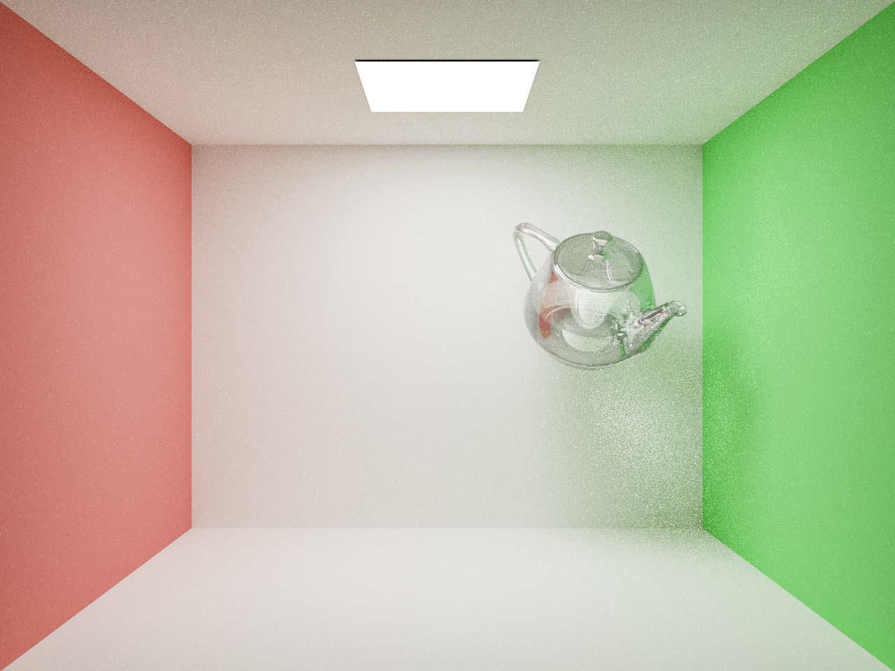
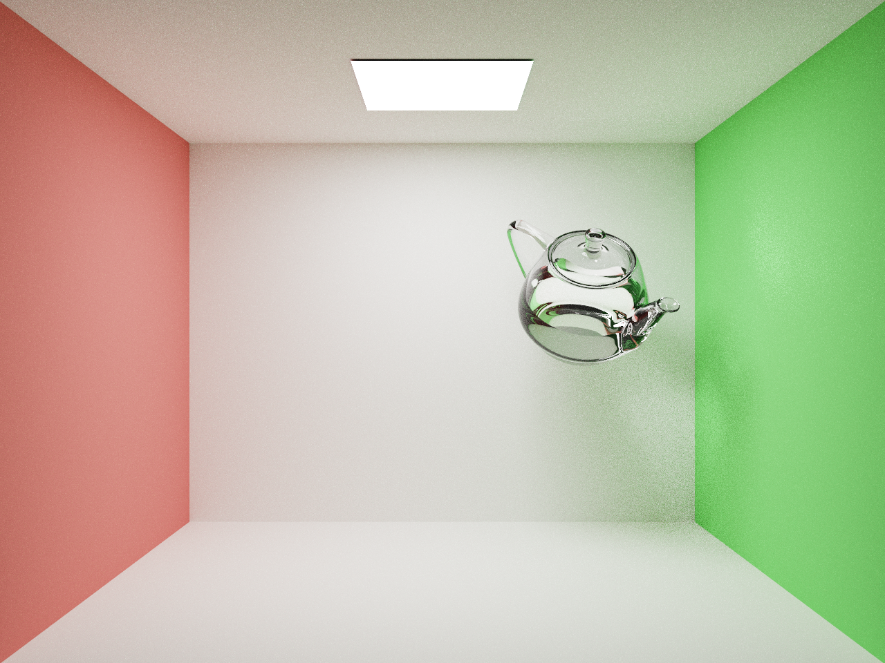
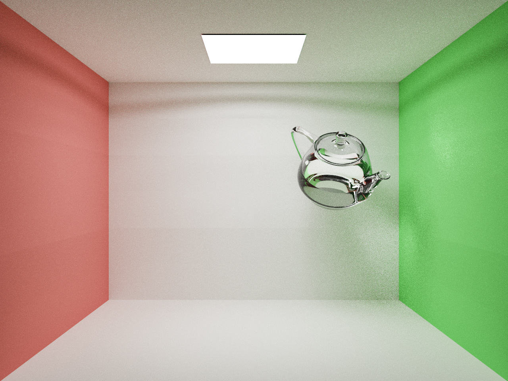

# DEBUG Log

1. Schlick's approximation (of Fresnel term) doesn't work well presumably because of the mesh complexity of the glass teapot.

Schlick's (compare the teapot with the rendering above):

2. Member functions weren't properly made constant. One of them of dielectric (glass) happened to modify the index
of refraction, and thus, cause another wrong-looking teapot

Wrong teapot:

Correct teapot:

3. EPSILON should be considered carefully. During shadow testing (whether there is an occulsion between the 
shading point and the light), there should be two EPSILON. One for avoiding self intersection, one for avoiding
intersection with the light.

Wrong shadow (pay attention to the strange pattern on the wall)

4. Really couldn't get CUDA debugger work in VS. It's a [bug!](https://forums.developer.nvidia.com/t/nsight-visual-studio-edition-2022-2-error-debugging-buttons-greyed-out-nsight-monitor-does-not-autolaunch-nsight-monitor-shows-0-connections/226034)