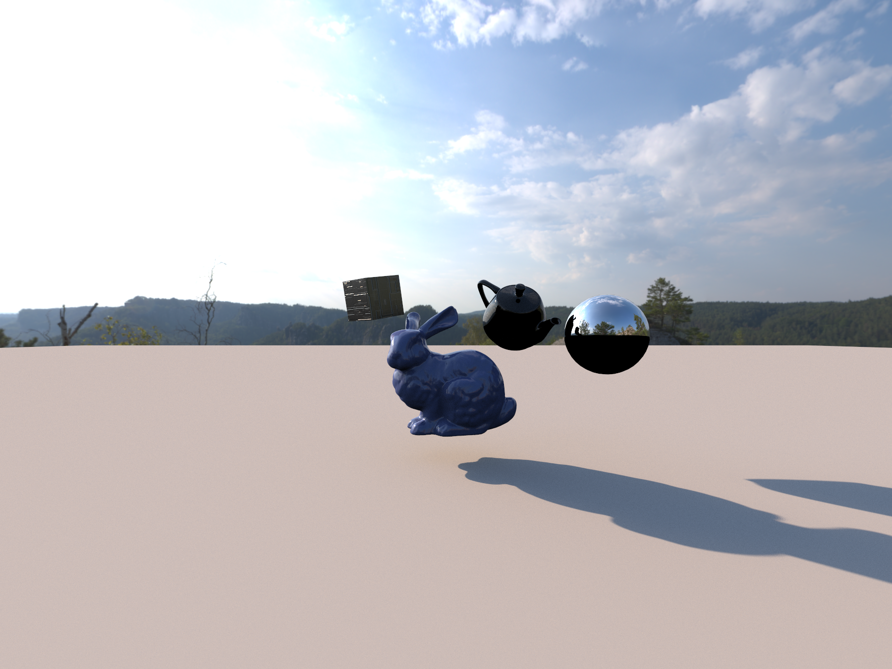
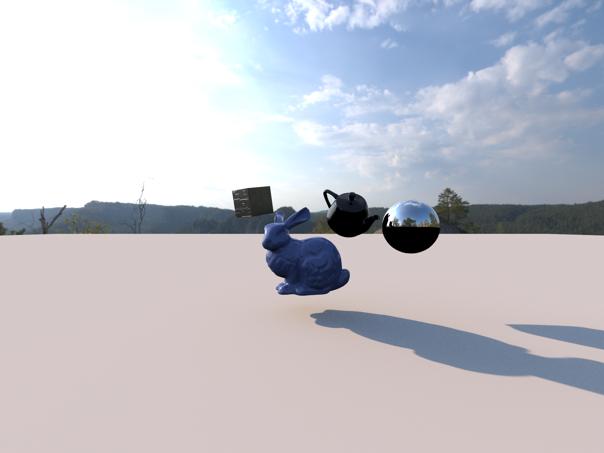
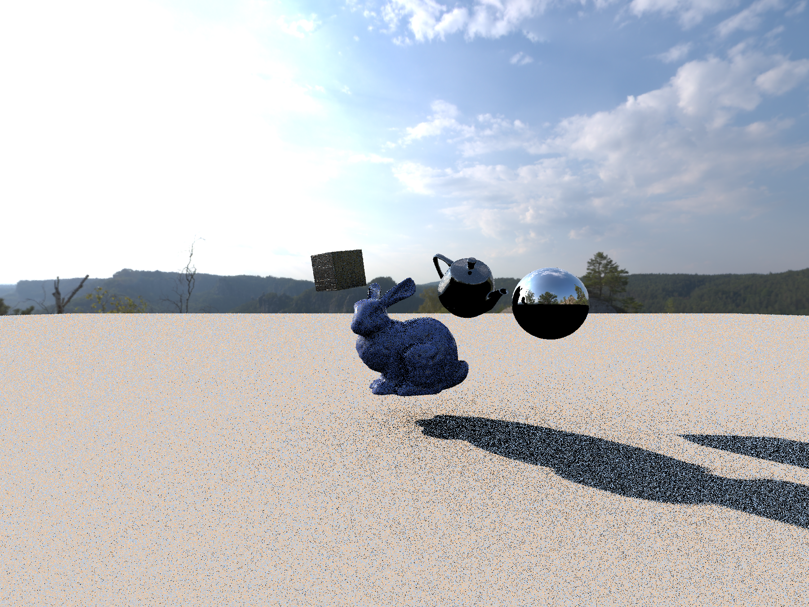
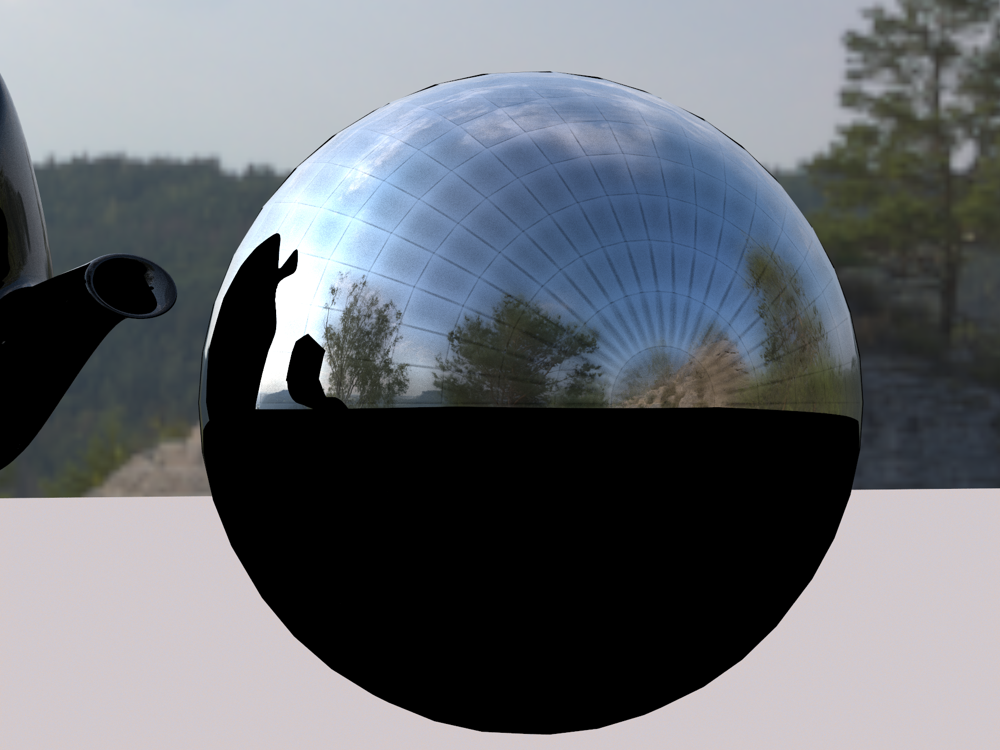

# Implementing ReSTIR DI

## Resampled Importance Sampling

### Notations

To avoid confusion, we'd like to clarify different meanings of "sample" and give other terms to distinguish them.

- sample ray. It's relative to each pixel. Sample per pixel (spp) captures this meaning. To distinguish, we call it spp.
- light/BSDF sample. It's relative to each path segment, or in a traditional sense, each shading point.
- candidate sample. The concept specific to RIS and ReSTIR. To distinguish, we call it candidate. A candidate can also be type light or BSDF.

For ReSTIR DI (direct illumination), we only have one shading point. We denote the resample budget -- number of light candidate
and number of BSDF candidate -- by `M_Light` and `M_BSDF` respectively.

### Version 1

Most basic RIS on light only

### Version 2

***RIS that combines light candidates and BSDF candidates with MIS weight.***

Note that MIS (multiple importance sampling) is NOT specific technique. It effectively combines samples from multiple
domains, light samples and BSDF samples in most scenarios in physically-based rendering literature.

We will use our reference single-kernel path tracer as the reference to validate convergence (correct looking) and
compare performance (noise level, FPS). The trace depth is set to 1 for the sake of DI. We didn't use the streamed
version path tracer because it wouldn't match the expected DI result. (Radiance accumulation of BSDF samples will be
postponed to next path segment.) We will refer to it as "the reference" from now on.

We found that using `M_Light = 16` and `M_BSDF = 4` candidate samples is a reasonable choices. We will refer to
our path tracer under this setting as "RIS".

- Converged rendering comparison:

The reference:

RIS:

- Real-time performance comparison:

The reference:

RIS:

The reference renders at 57.5 FPS, while version 2 renders at 29 FPS.
In order to be fair, we compare the reference rendering with 2 spp against our RIS rendering with 1 spp
in the real-time performance comparison, and 512 spp against 256 spp in the convergence comparison.

The difference in real-time comparison is quite obvious. The sky is an environment map, which is also treated
as light (a giant light). The top-left subregion is the brightest, and this helps explain why the ground
on the bottom-right corner is not as clean. Recommended by the ReSTIR DI paper, we generate light candidates
from the target function $\hat{p}$ (I'd like to call it cheap function) absent of shadow ray occlusion test. Thus, noises in this region mostly come from the occlusion by the 4 floating meshes, and cannot be addressed
well by RIS-only version 2 code.

## Spatial Reuse

I implemented spatial reservoirs reuse first and didn't see much improvement, as pointed out by the Course Note.

Spatial reuse is built upon Version 2 RIS, and the performance dropped from 29 to 25 FPS.

A strange artifact was also found, most possibly caused by meshed sphere (sorry, this path tracer doesn't have native sphere supported)
and the bad sample sequence.

