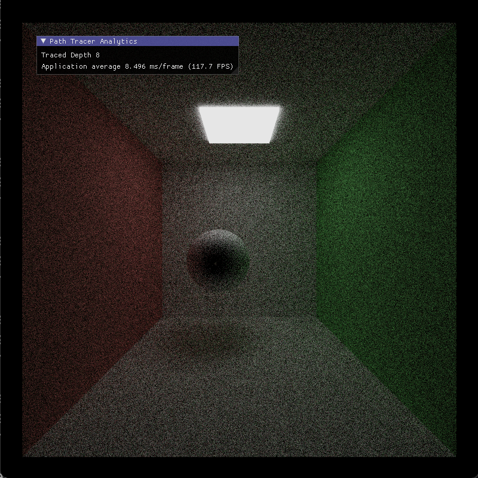
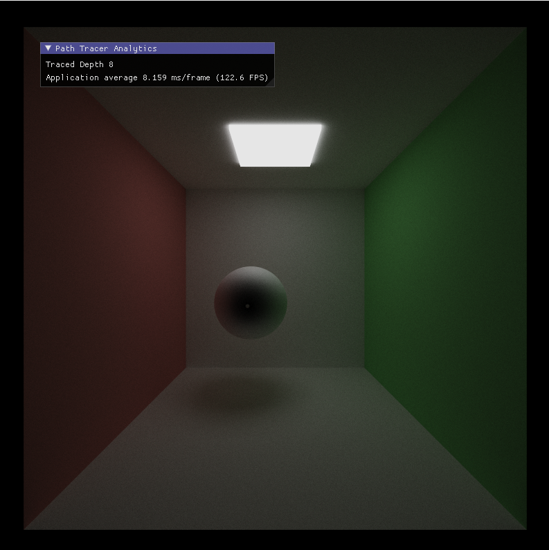
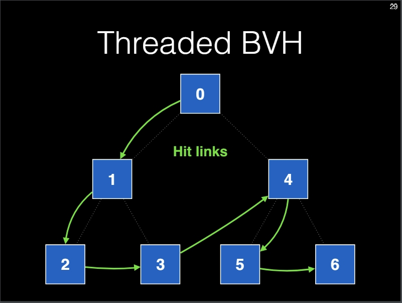
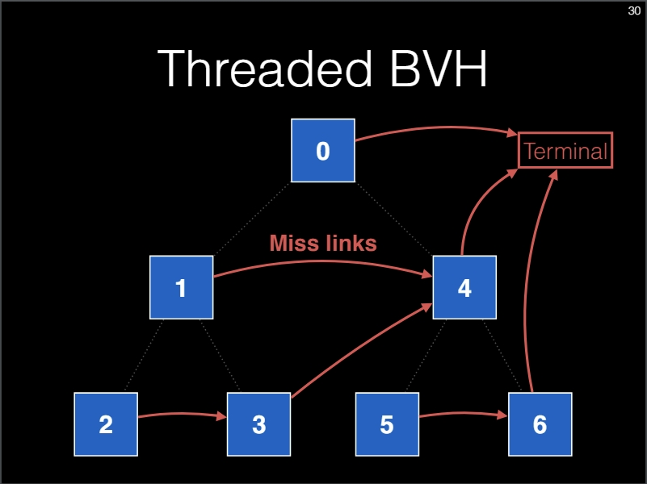
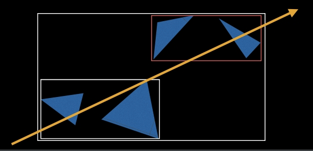
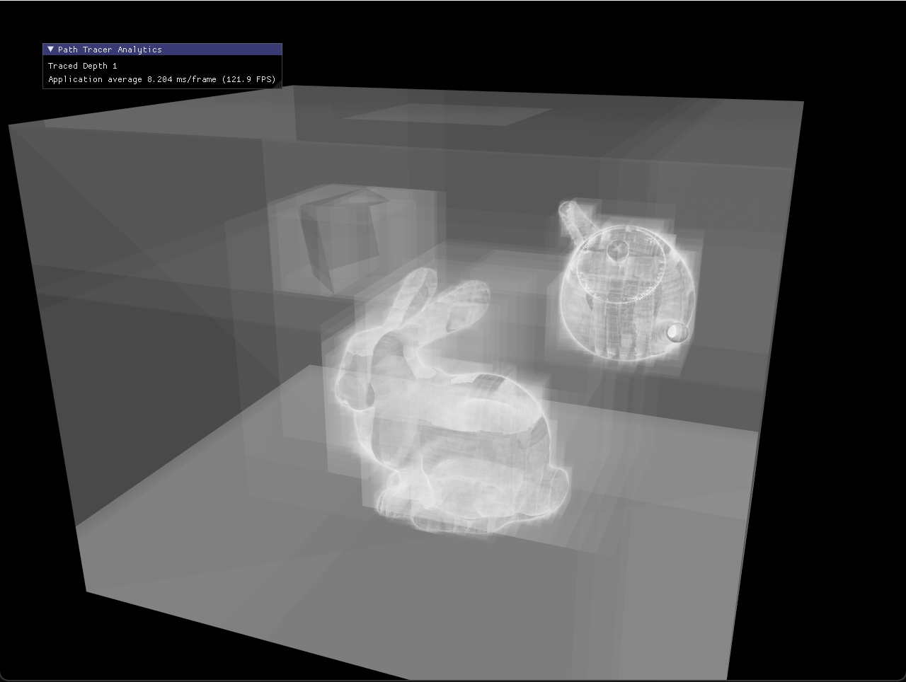
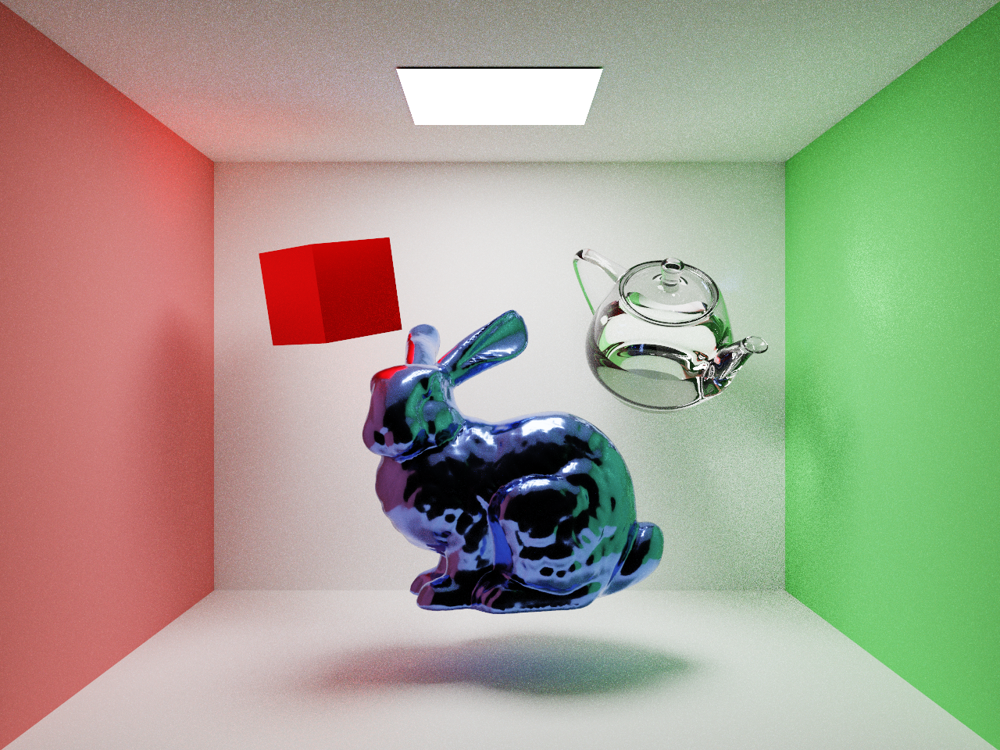
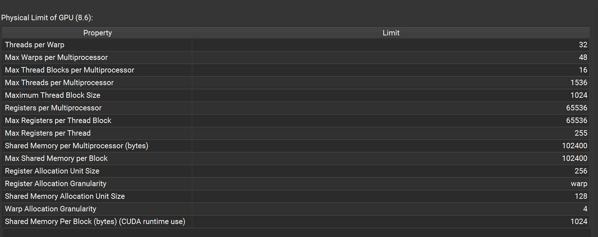
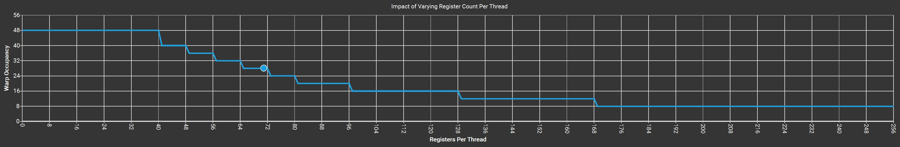

# CUDA Path Tracer

## Quick Intro

This project serves to:

1. refresh my memory on path tracing and related techniques;
2. gain more insight on shipping a path tracer to GPU;

It is forked from the starter code of [**University of Pennsylvania, CIS 565: GPU Programming and Architecture, Project 3**](https://github.com/CIS565-Fall-2022/Project3-CUDA-Path-Tracer), and will not be submitted as any schoolwork.

## System Spec

- Windows 11 23H2 x64 system
- MSVC 19.38.33133.0
- Nvidia RTX 3080 Laptop GPU
- Driver Version: 551.61
- CUDA Version: 11.7
- NVCC Version 11.7.64

## Primary Reference

Since I have learned and (painfully) debugged those low-level interfaces in a past CPU path-tracer project, it's more efficient to use someone else's code.

The primary reference code I used is by [@HummaWhite](https://github.com/HummaWhite/Project3-CUDA-Path-Tracer), who will be referred as "the author" in this README.

For code irrelevant to CUDA, I mostly copy after understanding them. For CUDA-related code, I spent more time worship the technical beauty.
The parallizable BVH is the biggest reason I picked this repo as my reference.

## Other References

- [CIS 565 Discussion Slides](https://onedrive.live.com/view.aspx?resid=A6B78147D66DD722%2196250&authkey=!AHM5o0OIig5tENc)
- [CPU Path Tracer](https://github.com/Thomaswang0822/torrey_renderer): my own class project
- [MTBVH](https://cs.uwaterloo.ca/~thachisu/tdf2015.pdf)
- [More advanced stackless BVH from Nvidia](https://diglib.eg.org:8443/server/api/core/bitstreams/1c026ceb-0c54-4e20-9fd2-2ff77222894d/content)
- [An awesome algorithm overview](https://computergraphics.stackexchange.com/a/5153/21736): focuses on Monte-Carlo and MIS ideas.
- [Alias Method](https://keithschwarz.com/darts-dice-coins/): sampling from a discrete distribution in O(1); used for light sampling in the project.
- [CUDA Unified Memory](https://developer.nvidia.com/blog/unified-memory-cuda-beginners/)
- [MIS Overview](https://computergraphics.stackexchange.com/a/8631/21736): a great algorithmic overview of MIS with more explanations on derivations.

P.S. Documentation of traditional (CUDA-irrelevant) technical details can be found in my CPU path-tracer README.

## Step 1. A Minimal CUDA Path Tracer

It has no fancy materials, no mesh loader, and even no triangle supported. But it's not trivial at all. 
The biggest difference (from a traditional CPU PT) is the memory management behind the massive parallelism.

In addition to changing the path-trace function, which is recursive in nature, into iterative, there is an smarter way than pixel parallelization.
Briefly, we do ray parallelization by maintaining a pool of active rays. Terminated rays (miss, hitting light, etc.) get "picked out" from the pool.
They are moved to another pool and their data get updated to the rendering. This is called ***Stream Compaction***. Memory management is handled by
*thrust* API. More info can be found in the Discussion Slides starting from page 21.

Here is the illustration: the rendering converges from ~50 spp (top) to ~5000 spp (bottom).




## Step 2. Scene Loader and Bounding Volume Hierarchy

### scene resources memory management

I used the data structure design by the author directly, and would like to provide some explanation on this part.
Code of this section can be found in `scene.h`, ~~`scene.cu`~~ `scene.cpp` as well as `mesh.h, mesh.cpp`.

The `class Scene` is a giant container consisting of several classes and structs, like `RenderState, Material, MeshData`, etc.
If we break a path-tracer into 2 major phases, scene construction and path tracing, all other members in a `Scene` is for scene construction.
The only exception is these 2 members:

```cpp
    DevScene hostScene;
    DevScene* devScene = nullptr;
```

It's crucial to understand `DevScene` and particularly its relationship with `Scene`. The short answer is, `Scene` is on CPU(host) and `DevScene` is on GPU(device).
But this can be misleading. Since memory management on devices must be explicitly handled by the users (which means we must
call `cudaMalloc, cudaMemset, cudaMemcpy`, etc. by ourselves), we must first store a copy of scene on CPU before copying it to GPU.
This is the purpose of `struct DevScene` and the member variable names `hostSCene` and `devScene` become clear.

Data on GPU pointed by `DevScene* devScene` will be used to do computations (intersection tests and shading) in the path tracing phase.
It seems memory-wise inefficient to create another copy of scene data, `DevScene hostScene`, on CPU, but it's more convenient and arguably necessary to do so.
Some data structures stored in `Scene`, like `MeshData meshData`, is only used during scene construction but not path tracing.
This boils down to the fact that device memory (at least for now) is more limited than host memory. A RTX 4080 Super has 16 GB device memory,
while a 32 GB RAM on PC is a much cheaper and common setup. Say if you have a giant scene that takes 16 GB during construction but
only 10 GB is used during path tracing on device, you would prefer consuming 16+10 GB on host and only 10 GB on device.

### multi-threaded BVH

This brilliant idea was first proposed by **Toshiya Hachisuka** in 2015. I will elaborate the problem being addressed by MTBVH
and some implementation details.

BVH is nothing but a tree. More precisely, it's a tree whose node is axis-aligned bounding boxes (AABB). To traverse a tree, we
use either recursion or a stack. It's well known that recursion is a GPU-unfriendly behavior. At the same time, using
a stack isn't a great choice either, because it's implemented via GPU local memory. Though modern GPUs start to support
recursive calls, stack based traversal, and with these new features we can implement our device side BVH more easily,
it's still worth to learn and implement stackless BVH traversal. In the end, what we care the most, as CUDA programmers, 
should be parallelism and device memory bandwidth. Stacked-based memory consumes much higher memory, 512 Byte according to Hachisuka,
and this significant limits parallelism (number of rays traced in parallel).

Now it's threaded BVH that comes to rescue. The high-level idea is not difficult: precompute and store some information to
circumvent using a stack. Threaded BVH is originally proposed by [Brian Smits in 1998](https://citeseerx.ist.psu.edu/document?repid=rep1&type=pdf&doi=0bdde4941536d23948cfe74b3ab96aa1afb21d50).
Smits calls the info "skip pointers" and Hachisuka calls it "hit and miss links". They answer the question "which AABB (tree node)
to look at next if the ray hits/misses current AABB" respectively. I will "steal" 2 slides from Hachisuka to better
illustrate the point.




With this design, for each given ray, the traversal order of a threaded BVH is deterministic.
This is the fundamental reason for going stackless.

Multi-threaded BVH was built upon this idea. To further improve the performance, we want to visit the 
closer node/subtree first. Consider the diagram below, also from Hachisuka's slides. Suppose the above
threaded BVH corresponds to the yellow ray shown. The smaller white box should be the left subtree (node 1)
while the red box should be the right subtree (node 4). But for another ray in the opposite direction, we want
node 4 to be the left subtree and node 1 to be the right subtree. MTBVH catogorizes rays into 6 groups depending on
their major direction, which is 3 (the dimension with largest magnitude) x 2 (positive or neative). In tree
terminology, a MTBVH is a forest consisting of 6 thread BVH trees, and the ray direction decides
which tree to traverse. 



Hachisuka advocates using a cube map to store this MTBVH, but in our code we just use an
array of 6 BVH for simplicity. I'd like to add some comments to his pseudocode:

```cpp
node = cubemap(root_tex, ray.direction);  // find which BVH to traverse
while (node != null) {
	if (intersect(node.bonding, ray)) {  // hit
	 	if (node.leaf) {
			hit_point = intersect(node.triangles, ray);
	 	}
	 	node = node.hit;  // follow the hit link
	} else {
		node = node.miss;  // follow the miss link
	}
}
```

At this step, we are able to render a scene with several complex meshes. The below rendering
uses the debugging code by HummaWhite to visualize the BVH.



## Step 3. MIS and Performance Improvement



### MIS

In this major step, I added Multiple Importance Sampling (MIS) on top of 3 physically-based materials -- Lambertian, dielectric, and metallic workflow.
I wouldn't dive into technical details of MIS, because I have implemented it carefully once and documented in [that README](https://computergraphics.stackexchange.com/a/8631/21736).
Also, [slides](https://cseweb.ucsd.edu/~tzli/cse168/sp2023/lectures/16_multiple_importance_sampling.pdf) from my advisor Tzu-Mao Li 
and an [answer from stackexchange](https://computergraphics.stackexchange.com/a/8631/21736) are very helpful.

Another technique worth mentioning is the **Vose's Alias Method** to sample from a discrete distribution in O(1).
It's used to achieve O(1) runtime when we do light sampling. [This post](https://keithschwarz.com/darts-dice-coins/),
though lengthy, is an enjoyment to read about effective sampling from a discrete distribution. For algorithm details,
please look at line comments in `sampler.h`.

### parallelism and performance

Again, I will focus more on CUDA-related details. After finishing all features in this section, I found a huge performance
deficit comparing to the reference code. Using the identical Cornell Box scene setting, my path tracer achieves ~10 FPS
while the author's achieves ~16 FPS. Fortunately, with Nsight Compute, I was able to identify the issue: for both kernels
`computerIntersections()` and `shadeSegment()`, my code uses about twice as much number of registers (#reg).
This significantly reduces occupancy, which can be interpreted by "the ratio of hardware resources being utilized". I would rather
not dive deep into all technical terms of an Nvidia GPU, because it will inevitably turn into a lengthy glossary.
For more details, please refer to [the official glossary](https://docs.nvidia.com/cuda/cuda-c-programming-guide/index.html#glossary).
The takeaway is, reduced occupancy leads to limited parallelism and higher latency, both of which harm rendering performance.

The cause of this issue is a painful lesson to learn, so I would like to share. TL;DR: put `__device__` functions in header
files such that "not-so-smart" nvcc compiler can inline them and try to optimize register usage. The full story is, for
the `struct DevScene` (meaning Scene used on device), the author defines those lengthy `__device__` functions in the header
file but I followed "the standard" by declaring them in the header file and define them in `scene.cu`. Performance-wise,
"the standard" doesn't harm on CPU because function arguments are pushed to the stack. On a CPU core, the number of registers
is really limited, so you run out of registers anyway and have to use the stack, which is also very fast. But on GPU, it really
makes a difference because arguments of a non-inlined function will be stored in extra local variables and thus take up more registers.
By simply copying these function definitions back to the header file, my 2 kernels achieved the same number of registers used
and rendering speed became the same.

Also, Nsight Compute profiling suggested that high register usage is still the performance bottlenck.
I attempted to increase the occupancy by choossing different block sizes (number of threads in a thread block).
But Nsight Occupancy Calculator confirmed that it wouldn't happen. Though I didn't reduce register usage
by much without serious code refactoring, I strongly recommend this Calculator because it delivers lots of very useful
information clearly. For example, the hardware resource table and this occupancy-vs-registers graph
is particularly helpful for future optimization.





`shadeSegment()` uses 71 registers per thread, which is marked on the graph.

For more details on my debugging via Nsight Compute, see `Nsight-debug/` sub-directory.

### other miscellaneous bugs

I've documented several CUDA-irrelevant bugs in [a separate file](./DebugLog.md). Check it out if you
are curious.